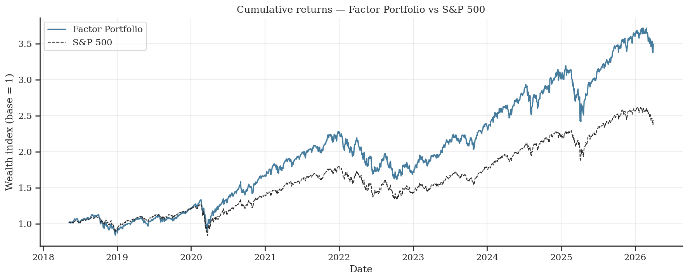
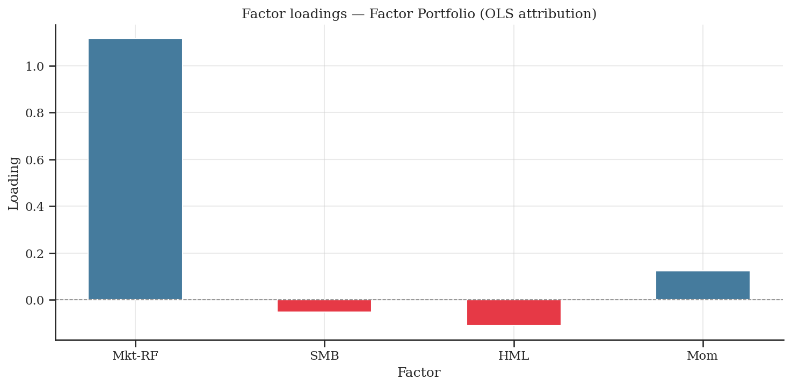

# Factor Investing & Systematic Portfolio Construction

## Overview

This project builds a systematic long-only equity portfolio on the S&P 500 universe using the Fama-French four-factor model (MKT, SMB, HML, WML).

The objective is to assess whether factor-based signals can be translated into a disciplined, rules-based portfolio construction framework that generates risk-adjusted returns above the market benchmark.

The project covers:
- Rolling factor loading estimation via OLS regression
- Expected return signal construction from factor premia
- Monthly portfolio optimisation under realistic constraints
- Out-of-sample backtesting with transaction costs
- Performance attribution via factor regression

---

## Key Idea

Factor models decompose asset returns into systematic exposures to documented risk premia and an idiosyncratic residual. The central question is:

> Can rolling factor loadings be used as reliable signals for portfolio construction, and does the resulting strategy generate returns beyond factor compensation?

This project explicitly separates:
- **Signal construction** — factor loadings and premia
- **Portfolio optimisation** — constrained mean-variance under realistic limits
- **Performance attribution** — OLS decomposition of portfolio returns

---

## Methodology

**Data**
- Universe: S&P 500 current composition (475 stocks after filtering)
- Sample: 10 years of daily log returns via yfinance
- Factors: Fama-French MKT, SMB, HML and Momentum (WML) from Kenneth French Data Library
- Benchmark: S&P 500 index (^GSPC)

**Factor loadings**
- Rolling OLS regression (252-day window) of excess returns on four factors
- One set of loadings per asset per day

**Signal construction**
- Expected return signal: dot product of rolling loadings and rolling factor premia (252-day mean)
- Signal computed for each asset at each rebalancing date

**Portfolio construction**
- Optimiser: cvxpy (mean-variance objective with risk penalisation γ = 1)
- Covariance: Ledoit-Wolf shrinkage
- Constraints:
  - weights sum to 1
  - no short selling (w ≥ 0)
  - maximum weight per asset: 5%
  - tracking error vs market-cap benchmark: ≤ 4% annualised
  - monthly turnover: ≤ 20%
- Rebalancing: monthly
- Fallback: market-cap weights if optimiser fails

**Transaction costs**
- Modelled as: r_net = r_gross - cost_rate × turnover
- cost_rate = 0.1% per unit of turnover

---

## Results

| Metric | Value |
|---|---|
| Annualised net return | 15.89% |
| Annualised volatility | 23.00% |
| Sharpe ratio (annualised) | 0.670 |
| Maximum drawdown | -31.38% |
| Average Information Ratio | 0.731 |
| Average monthly turnover | 0.88% |

**Performance attribution (OLS)**

| Factor | Loading | p-value |
|---|---|---|
| MKT-RF | 1.116 | < 0.001 |
| SMB | -0.053 | < 0.001 |
| HML | -0.110 | < 0.001 |
| Momentum | 0.123 | < 0.001 |
| Alpha | -6.8e-05 | 0.361 |

R² = 0.948

**Key findings**
- 94.8% of portfolio variance is explained by the four systematic factors
- Alpha is not statistically significant — consistent with large-cap market efficiency
- Dominant exposures: market risk (beta > 1) and positive momentum
- Negative HML loading reflects a growth tilt, rewarded over the sample period

---

## Preview

---

## Limitations

- **Survivorship bias**: the universe is based on current S&P 500 composition. Delisted and bankrupt firms are excluded, which likely overstates backtest performance
- **Look-ahead bias in benchmark**: market-cap weights are based on current capitalisation data, not historical
- **Tracking error constraint**: the 4% limit proved tight for this universe, constraining active tilts
- **Static gamma**: the risk aversion parameter γ = 1 is not calibrated or optimised
- **Linear transaction costs**: no market microstructure effects or bid-ask spread modelling

---

## Tech Stack

- Python
- pandas, numpy
- cvxpy (portfolio optimisation)
- statsmodels (OLS, RollingOLS)
- scikit-learn (Ledoit-Wolf shrinkage)
- arch
- matplotlib, seaborn
- yfinance, beautifulsoup (data)

---

## Structure

- `src/` → core modules (data, regression, portfolio, backtest, metrics, plot, sanity_check)
- `results/` → saved outputs (portfolio weights, returns, metrics, plots)
- `notebooks/` → analysis and visualisation
- `main.py` → full pipeline
- `docs/technical_report.pdf` → detailed methodology

---

## Takeaway

Factor-based signals can be embedded into a disciplined optimisation framework. The portfolio delivers a positive Sharpe ratio with low turnover, but does not generate statistically significant alpha — consistent with the efficiency of large-cap US equity markets and the use of publicly available data.

Reducing model complexity and constraining estimation error (via shrinkage and bounded weights) produces more stable results than unconstrained optimisation.
